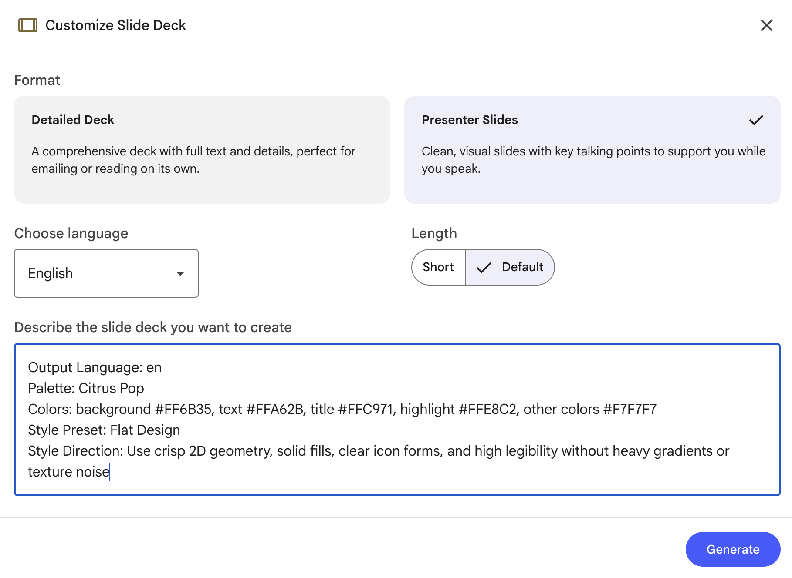

# Slide Style Prompt Generator


A multilingual web app that helps users generate slide-style prompts for LLM tools (for example Gemini and NotebookLM).

## Features

- 3-step generation flow:
  - Slide style
  - Color palette/theme
  - Content + category chips
- Multilingual UI:
  - English (`/en`)
  - Traditional Chinese (`/zh-TW`)
  - Simplified Chinese (`/zh-CN`)
  - Japanese (`/ja`)
  - Spanish (`/es`)
  - German (`/de`)
  - French (`/fr`)
- Copy and export prompt text
- Theme mode (light/dark)
- Config versioning (`settings_version`) for palette/style/category upgrades

## How To Use it

1. Choose the slide style you want, or add new settings as you wish
2. Copy and paste the prompt when you want to generate slide deck in NotebookLM


## Notes

- All data are stored in browser, not in any server.
- No runtime environment variables are required by default
- Prompt options are automatically upgrade when load to the page

## Tech Stack

- React + TypeScript + Vite
- Tailwind CSS
- react-i18next
- Playwright + Vitest

## Local Development

### 1) Install dependencies

```bash
npm install
```

### 2) Run dev server

```bash
npm run dev
```

### 3) Build

```bash
npm run build
```

### 4) Run tests

```bash
npm run test
npm run test:e2e
```
